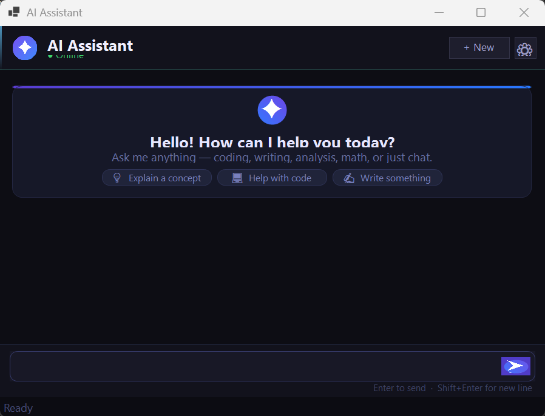

# AI Chatbot — .NET 8 Windows Forms + Claude API

> **Assignment #2 — AI-Based Mini Project**  
> A fully-featured AI chat application built with Windows Forms and the Google Claude API.

---

## Table of Contents
1. [Overview](#overview)
2. [Features](#features)
3. [Project Structure](#project-structure)
4. [Prerequisites](#prerequisites)
5. [Getting Your API Key](#getting-your-api-key)
6. [Running Locally](#running-locally)
7. [Running with Docker](#running-with-docker)
8. [Architecture](#architecture)
9. [Error Handling](#error-handling)
10. [Screenshots](#screenshots)

---

## Overview

This application is an AI chatbot that communicates with **Anthropic's Claude** model through the official REST API. The user interacts via a dark-themed Windows Forms interface with chat bubbles, a typing indicator, and status feedback.

---

## Features

| Category | Details |
|---|---|
| **User Interface** | Dark-themed Windows Forms with chat bubble layout, avatars, timestamps |
| **AI Integration** | Anthropic Claude API (`/v1/messages`) with conversation history |
| **Input Handling** | Rich text input · Enter to send · Shift+Enter for newlines |
| **AI Output** | Streamed-style bubbles with token usage in status bar |
| **Error Handling** | Auth errors · rate limits · timeouts · cancel support |
| **Docker** | Multi-stage Windows container build |
| **Settings** | In-app API key management dialog |

---

## Project Structure

```
AIChatbot/
├── AIChatbot.sln                   # Visual Studio Solution
├── Dockerfile                      # Multi-stage Windows container
├── docker-compose.yml              # Compose configuration
├── README.md                       # This file
│
└── AIChatbot/
    ├── AIChatbot.csproj            # Project file (.NET 8 WinForms)
    ├── Program.cs                  # Entry point + DI bootstrap
    ├── appsettings.json            # Configuration (API key, model, etc.)
    │
    ├── MainForm.cs                 # Chat window — UI logic
    ├── MainForm.Designer.cs        # Auto-layout code (controls, styling)
    ├── SettingsForm.cs             # API key settings dialog
    │
    ├── Models/
    │   ├── ChatMessage.cs          # Domain model for a chat turn
    │   └── ApiModels.cs            # Anthropic request/response DTOs
    │
    └── Services/
        └── AnthropicService.cs     # HTTP client wrapper for Claude API
```

---

## Prerequisites

| Requirement | Version |
|---|---|
| .NET SDK | 8.0 or later |
| Windows OS | Windows 10/11 (WinForms requirement) |
| Visual Studio | 2022 (optional, for IDE support) |
| Docker Desktop | 4.x+ with **Windows containers** enabled |

---

## Getting Your API Key

1. Sign up at [https://aistudio.com](https://aistudio.google.com)
2. Navigate to **API Keys** → **Create Key**
3. Copy the key (it starts with `sk-ant-`)

---

## Running Locally

### Option A — Visual Studio

1. Open `AIChatbot.sln` in Visual Studio 2022
2. Edit `AIChatbot/appsettings.json`:
   ```json
   {
     "Anthropic": {
       "ApiKey": "sk-ant-YOUR_KEY_HERE"
     }
   }
   ```
3. Press **F5** to run

### Option B — CLI

```bash
# 1. Restore packages
dotnet restore AIChatbot/AIChatbot.csproj

# 2. Set your API key in appsettings.json, then run:
dotnet run --project AIChatbot/AIChatbot.csproj
```

---

## Running with Docker

> **Important:** Windows Forms requires **Windows containers** in Docker Desktop.  
> Switch: Docker Desktop tray icon → *Switch to Windows containers…*

### Build & Run

```bash
# Build the image
docker build -t ai-chatbot .

# Run (API key via environment variable — recommended)
docker run --rm -e ANTHROPIC__APIKEY=sk-ant-YOUR_KEY ai-chatbot
```

### Using docker-compose

```bash
# Set your key and start
ANTHROPIC_API_KEY=sk-ant-YOUR_KEY docker compose up --build
```

---

## Architecture

```
┌─────────────────────────────────────────┐
│            MainForm (UI Layer)           │
│  ┌─────────────┐   ┌──────────────────┐ │
│  │ Message     │   │  Input Panel     │ │
│  │ Bubbles     │   │  RichTextBox     │ │
│  │ (FlowLayout)│   │  Send Button     │ │
│  └─────────────┘   └──────────────────┘ │
└───────────────────┬─────────────────────┘
                    │  async/await
┌───────────────────▼─────────────────────┐
│         AnthropicService (Service Layer) │
│  - Builds AnthropicRequest              │
│  - HttpClient (60s timeout)             │
│  - Maps HTTP errors → typed exceptions  │
│  - Reports status via event             │
└───────────────────┬─────────────────────┘
                    │  HTTPS POST
┌───────────────────▼─────────────────────┐
│        Anthropic REST API               │
│  POST https://api.anthropic.com/v1/     │
│       messages                          │
│  Header: x-api-key, anthropic-version   │
└─────────────────────────────────────────┘
```

---

## Error Handling

| Scenario | Behaviour |
|---|---|
| Missing / wrong API key | Warning dialog on startup; `UnauthorizedAccessException` in-chat |
| Network timeout | `TimeoutException` shown in chat bubble |
| Rate limit (429) | Friendly message; user can retry |
| Server error (5xx) | Error message in chat; app stays stable |
| User cancels | Cancel button stops the request cleanly |
| Malformed JSON response | Caught and shown as error |

---

## Configuration Reference

`appsettings.json`:

```json
{
  "Anthropic": {
    "ApiKey":       "sk-ant-...",
    "Model":        "claude-sonnet-4-20250514",
    "MaxTokens":    1024,
    "SystemPrompt": "You are a helpful AI assistant."
  }
}
```

All settings can also be overridden via environment variables using double-underscore notation:
```
ANTHROPIC__APIKEY=sk-ant-...
ANTHROPIC__MODEL=claude-sonnet-4-20250514
```

---

## Key Technologies

- **.NET 8 / Windows Forms** — UI framework
- **Anthropic Claude API** — AI backend (`claude-sonnet-4-20250514`)
- **Newtonsoft.Json** — JSON serialization
- **Microsoft.Extensions.Configuration** — appsettings / environment variables
- **HttpClient** — async HTTP with cancellation support
- **Docker** — multi-stage Windows container
